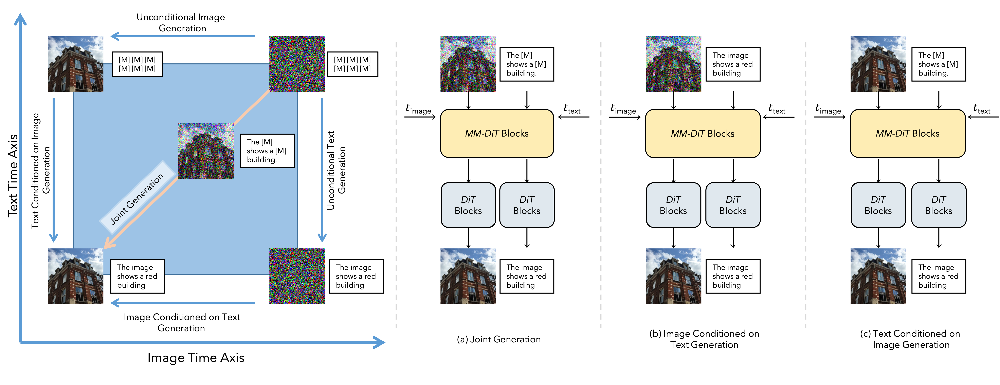

# Diffuse Everything: Multimodal Diffusion Models on Arbitrary State Spaces

<!-- []() -->
<!-- [](LICENSE) -->

Welcome to the official repository for **Diffuse Everything** (accepted at ICML 2025). 



## Latest Update
[Jun 05, 2025] Code will soon be public. Please stay tuned!

[May 01, 2025] Diffuse Everything was accepted to ICML 2025.


## Features

- **Dataset Processing**: Support for download and processing of the dataset 
- **Multimodal Generation**: Support for text-to-image, image-to-text, and unconditional generation
- **Flexible Training**: Supports different training strategies and configurations
- **Advanced Sampling**: Implements various sampling techniques for high-quality generation
- **FID and CLIP Score Evaluation**: Built-in evaluation metrics for generated content
- **Distributed Training**: Native support for multi-GPU training

## Installation

1. Clone the repository:
```bash
git clone [repository-url]
cd Multimodal-Diffusion
```

2. Install the dependencies:
```bash
pip install -r requirements.txt
```

## Dataset Preparation
We provide scripts to download and preprocess the dataset. Because the SAM dataset is too heavy, we erase the original files after processing them into the latent space.  Please follow the steps as clearly outlined, you should only need to set `your_folder` or other variables, but do include the `images, tokens` as described in the scripts.
For the SAM dataset you need to download the file containing the links to the raw data from [SAM download](https://ai.meta.com/datasets/segment-anything-downloads/p). If this file is named `cc12m_links.txt` you can use the following script to download the dataset using 8 gpus:
```bash
torchrun --nproc-per-node 8 download_sam.py main --download_links cc12m_links.txt --output_folder your_folder/images --target_size 256 --batch_size 256 
```
To preprocess the captions you can use the following command:
```bash
torchrun --nproc-per-node 8 download_sam.py process-captions --tokenizer clip --block_size 120 --output_folder your_folder/tokens
```

Finally we create an index file to provide to the dataloader. You can create this index using the following command:
```bash
torchrun --nproc-per-node 8 download_sam.py process-indexes --folder your_folder
```
Finally update the `configs/sam_llava.yaml` file with the paths to your files.

## Training
We use wandb to check our training. If wandb is enabled we will log images every `--log_rate` iterations. These will be generated either conditionally if only  one modality is being trained or unconditionally. In both cases the result will be without using guidance, so samples will look worse, and should be understood as rough guidelines. 

We also perform FID evaluation every `--eval_rate` iterations without guidance. For other options please consult the `training.py` file.


### Basic Training

To start training you can use one of the followin commands. We recommend using the training strategy that we recommended in our paper, as otherwise it can be hard for the model to learn all tasks appropriately. Special emphasis should be placed to the text to image task. 

**Stage 1 Training** In this stage we train the noisy text to image model. For this stage make sure to set `text-depth` to 0 in the `mmdit.yaml`. A sample command to train is as follows:

```bash
torchrun training.py \
    --modality continuous \
    --use_all_times \
    --batch_size 256 \
    --dir output_directory \
    --dataset_config_path configs/sam_llava.yaml \
    --net_config_path configs/mmdit.yaml \
    --enable_wandb
```
**Stage 2 Training** In this stage set `text-depth` to your desired value in `mmdit.yaml`. When loading the checkpoint since the model has changed, you need to comment out the line where the optimizer is loaded. Additionally you should load from the EMA so that the weights are correct. You can also freeze the continuous component if you wish using `--freeze_image`. This can be helpful if you want to preserve the result from the previous stage.
```bash
torchrun training.py \
    --modality multimodal \
    --use_all_times \
    --freeze_joint \
    --load_from_ema \
    --batch_size 256 \
    --dir output_directory \
    --dataset_config_path configs/sam_llava.yaml \
    --net_config_path configs/mmdit.yaml \
    --load_checkpoint ckpt_path \
    --enable_wandb
```
**Stage 3 Training** In the final stage we train the model for a couple extra iterations on all tasks. This stage can be tricky as it could destroy the previous learned features, so track your training carefully. A sample command is:
```bash
torchrun training.py \
    --modality multimodal \
    --use_all_times \
    --batch_size 256 \
    --dir output_directory \
    --dataset_config_path configs/sam_llava.yaml \
    --net_config_path configs/mmdit.yaml \
    --load_checkpoint ckpt_path \
    --enable_wandb
```

## Sampling
By default the commands here will download the model from hugginface. If you wish to sample from a model you are training use the `--load_checkpoint` flag.
### Unconditional Sampling
You can generate samples using a trained model. For example to generate 64 images using 4 gpus you can use the command:

```bash
torchrun --nproc_per_node=4 sampling.py sampling \
                --guidance_final_time {final_time} \
                --dir {folder_name} \
                --num_steps 50 \
                --cfg_scale 5. \
                --guidance_left .3 \
                --guidance_right .8 \
                --num_samples 64 \
                --batch_size 64 \
                --seed 42
```

### Conditional Sampling
If you have downloaded the dataset following the instructions above, you can sample conditionally by looping over the dataset using the following command:
```bash
torchrun --nproc_per_node=8 sampling.py sample-dataset-conditional \
                    --modality continuous \
                    --dir ${folder_name} \
                    --num_steps 50 \
                    --cfg_scale 5. \
                    --guidance_left .3 \
                    --guidance_right .8 \
                    --seed 42 --batch_size 512 \
                    --repeat_text
```
You can change the modality to `discrete` to generate samples from text to image.

You can also generate images from a `.json` file with prompts. You can use the following command. We provide the captions that we used to evaluate FID in the `coco-captions.json` file. 
```bash
torchrun --nproc_per_node=8 sampling.py sampling-conditional \
                    --dir ${folder_name} \
                    --num_steps 50 \
                    --cfg_scale 5. \
                    --guidance_left .3 \
                    --guidance_right .8 \
                    --seed 42 --batch_size 512 \
                    --limit_context_len 40 \
                    --prompt coco-captions.json \
```
### FID Evaluation
You can reproduce the result in our main paper by running the following command:

You can then evaluate FID by using the following command:

```bash
torchrun fid_score.py --path ${image_folder_path} --ref_path ${ref_path}
```
The reference path can be either a folder of images or a .npz containing a dictionary with the mean and std of the reference statistics. The script will print out the FID score and save the reference statistics for future reference.

## License
Unless otherwise stated in the header of the file, this repo is under the MIT license.

## Citation
@article{rojas2025diffuse,
  title={Diffuse Everything: Multimodal Diffusion Models on Arbitrary State Spaces},
  author={Rojas, Kevin and Zhu, Yuchen and Zhu, Sichen and Ye, Felix X-F and Tao, Molei},
  journal={arXiv preprint arXiv:2506.07903},
  year={2025}
}

## Acknowledgments

This project builds upon the SAM-LLaVA dataset introduced in Pixart-α. For the architecture we branched off of the great implementation from lucid rains. Other repos that have been useful in building this repo were score_sde, edm, uvit and DiT.